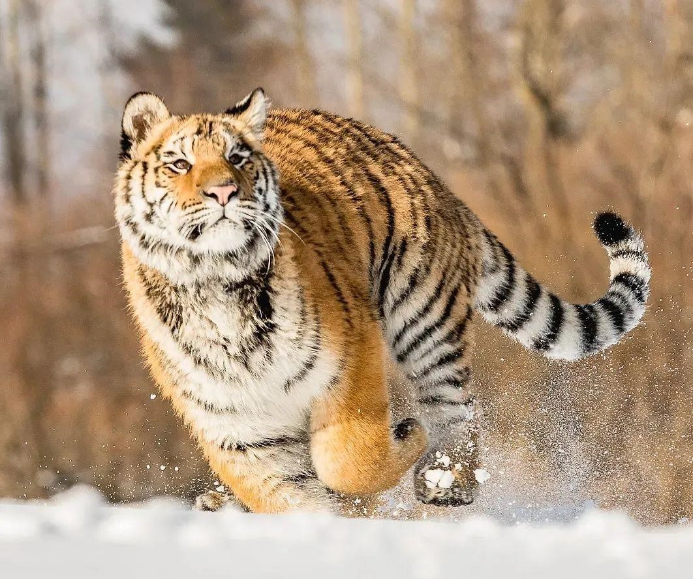
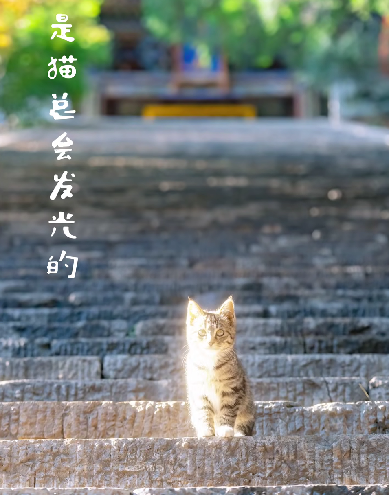

**给时间时间，让过去过去，用改变改变。**

宇宙的目的是什么？

如果这个宇宙的结局是注定的，是消亡，是归于死寂，那这或许更说明，只有过程才是最重要的，或许生命的价值就在于你能够镇静而又激动地欣赏这过程的美丽和悲壮。

尽管去做猫吧，去做一只不被定义的猫。

<!-- 

 -->

人所产生的不适感大都来自过去所学习的错误知识，消除或改正这些错误，我们就能适应。危险是真实存在的，但恐惧只是一种选择，我们总可以去选择相信

