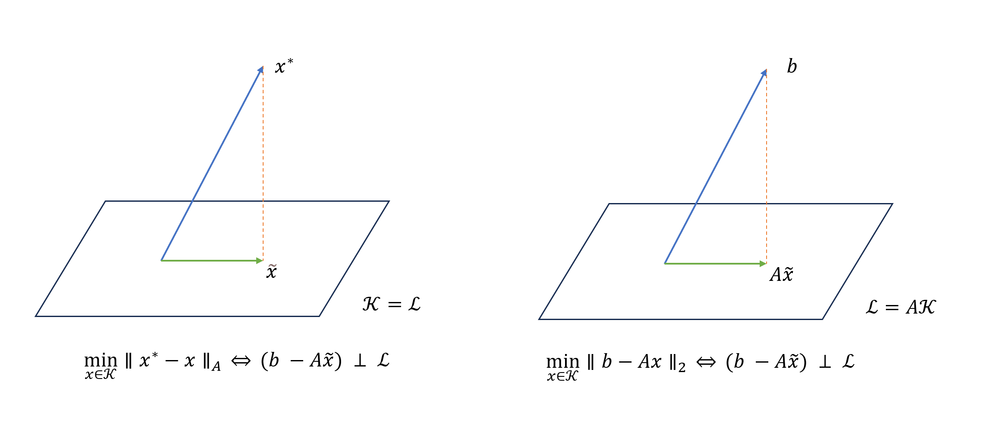
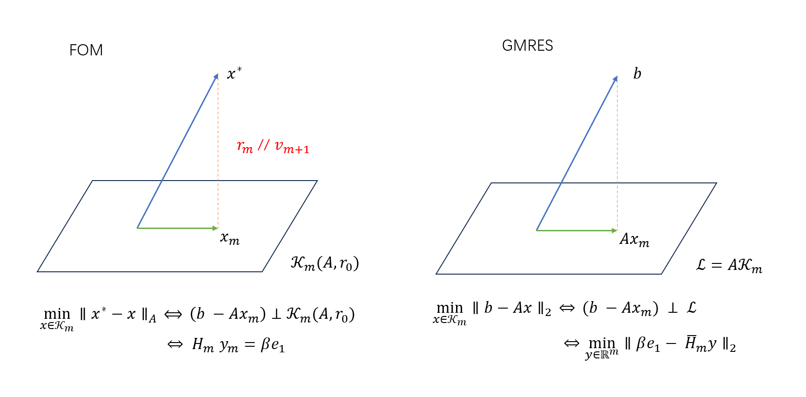
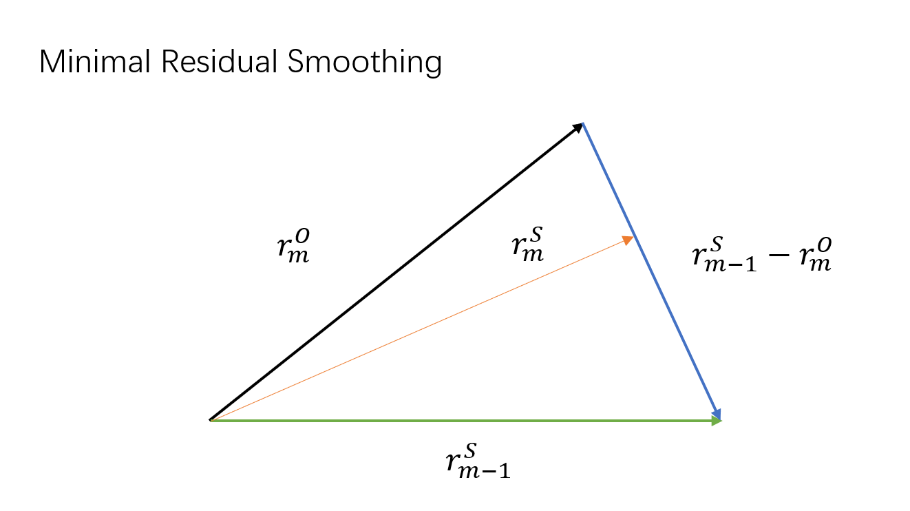

<h1> Iterative Methods for Sparse Linear Systems  (Yousef Saad) </h1>

<h2>Content</h2>

- [Basic Tools](#basic-tools)

    - [Additive and Multiplicative Processes](#additive-and-multiplicative-processes)

    - [Nonnegative Matrices](#nonnegative-matrices)

    - [Sparse Matrices](#sparse-matrices)

- [General Iterative Methods](#general-projection-methods)

    - [Motivation 1: Relaxation of Coordinates](#motivation-1-relaxation-of-coordinates)

    - [Motivation 2: Spliting to Construct Recursive Formula](#motivation-2-spliting-to-construct-recursive-formula)

    - [Motivation 3: Fixed Point Iteration to Construct Recursive Formula](#motivation-3-fixed-point-iteration-to-construct-recursive-formula)

- [General Projection Methods](#general-projection-methods)

    - [Motivation from Geometric View](#motivation-from-geometric-view)

    - [Formal Expression](#formal-expression)

    - [Examples for One-Dimensional Projection Processes](#examples-for-one-dimensional-projection-processes)

- [Krylov Subspace Methods](#krylov-subspace-methods)

    - [Motivation](#motivation)

    - [FOM VS GMRES](#fom-vs-gmres)

    - [CG algorithm](#conjugate-gradient-cg-algorithm)

    - [Arnoldi algorithm VS Lanczos algorithm](#arnoldi-algorithm-vs-lanczos-algorithm)

- [Polynomial Preconditioners (Filters)](#polynomial-preconditioners-filters)

    - [Neumann Polynomial](#neumann-polynomial)

    - [Chebyshev polynomial](#chebyshev-polynomial)

    - [Least squares polynomial](#least-squares-polynomial)

- [Multigrid Methods](#multigrid-methods)

    - [Motivation of MG](#motivation-of-mg)

    - [Algorithm of MG](#algorithm-of-mg)

    - [Convergence Analysis of MG](#convergence-analysis-of-mg)

- [Domain Decomposition (DD) Methods](#domain-decomposition-dd-methods)

    - [Motivation of DD](#motivation-of-dd)

    - [Direct solution for non-overlapping partitioning](#direct-solution-for-non-overlapping-partitioning)

    - [Schwarz alternating procedures (SAP)](#schwarz-alternating-procedures-sap)

--------------------------------------------------------

# Basic Tools

## Additive and Multiplicative Processes

For example, suppose $v_1, v_2, v_3$ are orthogonal vectors.

Classical Gram-Schmidt (CGS) algorithm is additive process

$$ ( I - v_3v_3^T - v_2v_2^T - v_1 v_1^T ) x_4 $$

Modified Gram-Schmidt (MGS) algorithm is multiplicative process

$$ (I - v_3v_3^T)(I - v_2v_2^T)(I - v_1v_1^T) x_4 $$ 

Multiplicative process will always have better numerical properties.

**NOTE**:
Similar to the Jacobi and Gauss-Seidel iterations (see also below), what distinguishes the additive and multiplicative iterations is that the latter updates the component to be corrected at step $i$ immediately. Then this updated approximate solution is used to compute the residual vector needed to correct the next component.

----------------------------------------------------------------

## Sparse Matrices

### Graph Representations
The adjacency graph of a sparse matrix is a graph $G=(V, E)$ whose $n$ vertices in $V$ represent the $n$ unknowns. There is an edge from node $i$ to node $j$ when $a_{ij}\neq 0$. Graph theory is an ideal tool for representing the structure of sparse matrices.

Note: A matrix is reducible if its graph is not connected and irreducible otherwise. When a matrix is reducible, then it can be permuted by means of symmetric permutation into a block upper triangular matrix.

### Permutations and Reorderings
When the rows of a matrix are permuted, the order in which the equations are written is changed. On the other hand, when the columns are changed, the unknowns are in effect relabeled, or reordered.

$$ Ax = b \Rightarrow PAx = Pb, \quad AQQ^T x = b. $$

For symmetric permutation, $A_{\pi}=P_{\pi}AP^T_{\pi}$ where $\pi$ is a permutation, it is equivalent to relabeling the vertices of the graph without altering the edges.

#### Reordering methods

- Level-set Ordering (CMK order / reverse CMK)
- Independent Set Ordering (Used in multi-Elimination (block Gaussian Elimination))
- Multicolor Ordering
- Minimum degree (MD) Ordering
- nested dissection (ND) Ordering

### Storage Schemes

- Coordinate format
- Compressed sparse row (CSR) format
- Compressed sparse column (CSC) format

-----------------------------------------------------------------

# Basic Iterative Methods

## Motivation 1: Relaxation of Coordinates

### Jacobi iteration

Determine the $i$-th coordinate of the next iteration so as to annihilate the $i$-th component of the last residual vector for $i=1, \cdots, n$ at the same time.

$$
0 = (b - Ax^{(k+1)})_i = b_i - \begin{bmatrix} a_{i1} & \cdots & a_{in} \end{bmatrix} \begin{bmatrix} x^{(k)}_{1} \\ \vdots \\ x^{(k)}_{i-1} \\ x^{(k+1)}_{i} \\ x^{(k)}_{i+1} \\ \vdots \\ x^{(k)}_n \end{bmatrix}  \quad i=1, \cdots, n.
$$

In vecotr form, one has

$$ x^{(k+1)} = D^{-1} (E + F) x^{(k)} + D^{-1}b, $$

where we denote $A = D - E- F$, $D$ is diagonal of $A$, $-E$ is its strcit lower part and $-F$ is its strict upper part.

### Gauss-Seidel Iteration

If we determine the $i$-th coordinate of the next iteration to annihilate the $i$-th component of the residual vector with partially-updated $x$.

For forward Gaussian-Seidel iteration

$$
0 = (b - Ax^{(k+1)})_i = b_i - \begin{bmatrix} a_{i1} & \cdots & a_{in} \end{bmatrix} \begin{bmatrix} x^{(k+1)}_{1} \\ \vdots \\ x^{(k+1)}_{i-1} \\ x^{(k+1)}_{i} \\ x^{(k)}_{i+1} \\ \vdots \\ x^{(k)}_n \end{bmatrix}  \quad i=1, \cdots, n.
$$

In vecotr form, one has

$$ (D - E)x^{(k+1)} = Fx^{(k)} + b. $$

For backward Gauss-Seidel iteration

$$ (D - F)x^{(k+1)} = Ex^{(k)} + b. $$

## Motivation 2: Spliting to Construct Recursive Formula

In general, suppose $A = M - N$, then we have

$$ Ax = b \Rightarrow Mx = Nx + b \Rightarrow Mx^{(k+1)} = Nx^{(k)} + b. $$

For Jacobian iteration

$$ Ax = b \Rightarrow (D - E - F) x = b \Rightarrow Dx = (E + F)x + b. $$

$$ D x^{(k+1)} = (E + F) x^{(k)} + b. $$

For forward Gauss-Seidel iteration

$$ Ax = b \Rightarrow (D - E - F) x = b \Rightarrow (D - E)x = Fx + b. $$

$$ (D - E) x^{(k+1)} = F x^{(k)} + b. $$

For overrelaxation, 

$$ \omega A = (D - \omega E) - (\omega F + (1 - \omega) D) $$

$$ (D - \omega E) x^{(k+1)} = (\omega F + (1 - \omega) D) x^{(k)} + \omega b. $$

For alternating direction implicit methods (ADI) which deal with matrices comes from finite difference discretizations of elliptic and parapolic PDEs, i.e.,

$$ (H + V) u = b $$

add accelarator $\rho_k I$ in each step one has algorithm

- solve $(H + \rho_k I) u_{k+ \frac{1}{2}} = (\rho_k I - V)u_k + b$
- solve $(V + \rho_k I) u_{k+1} = (\rho_k I - H)u_{k+\frac{1}{2}} + b$

## Motivation 3: Fixed Point Iteration to Construct Recursive Formula

In general, the update formula is 

$$ x^{(k+1)} = G x^{(k)} + f, $$

whose limitation $x$ satisfying $(I - G) x = f$.

For spliting method, if $A=M-N$, we have 

$$ x^{(k+1)} = M^{-1}Nx^{(k)} + M^{-1}b, $$ 

thus $G=M^{-1}N = M^{-1} (M - A) = I - M^{-1} A$.

For Richardson's iteration

$$ x^{(k+1)} = x^{(k)} + \alpha (b - Ax^{(k)}) $$

we have $x^{(k+1)}= ( I - \alpha A)x^{(k)} + \alpha b$ where $G=(I-\alpha A)$

**Remark:**

Convergence of the basic iteration methods above relies on the Contraction mapping theorem, their analytic convergence can only be correct for some types of matrices.

--------------------------------------------------------------

# General Projection Methods

## Motivation from Geometric View

A projection process represents a canonical way of extracting an approximation to the solution of a linear system from a subspace.

Here we assume matrix $A$ is symmetric positive definite (SPD) since non-singular property is not enough for general projection process.

### Type 1: Orthogonal projection
A projection of $x^{\ast}$ is used to minimize $|| x^{\ast} - x ||$, however, since $x^{\ast}$ is not access, we have to use $A$-norm to transform it into known quantity $b$.

### Type 2: Oblique projection
A projection of $b$ is used to minimize $||b - Ax||$ directly.

**NOTE**: the difference between this two types is similar to forward error and backwardd error.

## Formal Expression
The projection methods above lead to the general expression

$$ \text{find } \tilde{x} \in x_0 + \mathcal{K} \quad \text{such that} \quad b-A\tilde{x} ~ \bot~ \mathcal{L} $$

where $\mathcal{K}$ is called the search subspace and $\mathcal{L}$ is call the subspace of constraints.

Most standard techniques use a succession of such projections and a new projection step uses a new pair of subspace $\mathcal{K}$ and $\mathcal{L}$.

### Matrix Representation
Let $V=[v_1, \cdots, v_m]$ be an $n\times m$ matrix whose column vectors form a basis of $\mathcal{K}$ and $W=[w_1, \cdots, w_m]$ be an $n\times m$ matrix whose column vectors form a basis of $\mathcal{L}$. Then the approximate solution is written as

$$ x = x_0 + Vy, $$

the orthogonal condition should be

$$ W^T A Vy = W^T r_0, \quad r_0 = b - Ax_0. $$

If $W^TAV$ is non-singular, then

$$ \tilde{x} = x_0 + V(W^T AV)^{-1} W^T r_0. $$

## Examples for One-Dimensional Projection Processes

One-dimensional projection processes are defined when

$$ \mathcal{K}=\mathrm{span} \{v\}, \quad \mathcal{L} = \mathrm{span} \{w\}. $$

Denote the update formula be $x \leftarrow x + \alpha v$, then the orthogonal condition $r:=b-Ax ~\bot~ w$ gives

$$ \alpha = \frac{\langle r, w\rangle}{\langle Av, w \rangle}. $$

Following are three popular choices.

- Steepest Descent: $v=r$ and $w=r$, each step equivalently minimizes $f(x)=\frac{1}{2}\Vert x-x^\ast \Vert_A^2$ in direction $-\nabla f:=b-Ax=r$.

- Minimal Residual: $v=r$ and $w=Ar$, each step equivalently minimizes $f(x)=\frac{1}{2}\Vert b-Ax \Vert_2^2$ in direction $r$.

- Residual Norm Steepest Descent: $v=A^Tr$ and $w=Av$, each step step equivalently minimizes $f(x)=\frac{1}{2}\Vert b-Ax\Vert_2^2$ in the direction $-\nabla f :=A^T r$, which is alsp equivalent to the steepest descent algorithm applied to the normal equations $A^TAx=A^Tb$.

**Remark:**
For convergence analysis, it can be well proved for the one-dimensional projection examples above, which need some conditions for matrix $A$. The general error bound is rather abstract and not that useful.

----------------------------------------------------------------------------------------------------

# Krylov Subspace Methods

## Motivation
When we are trying to find out the proper projection subspace $\mathcal{K}$, we may assume that $A$ is accessible only via a "black-box" subroutine that returns $y=Az$ givens any $z$ mainly for two reasons:

- the cheapest nontrivial operation that one can perform on a (sparse) matrix is to multiply it by a vector
- $A$ may not be represented explicitly as a matrix but may be available only as a subroutine for computing $Ax$.

Thus, we just define the Krylov space as 

$$ \mathcal{K}_m(A, v) := \text{span} \{v, Av, A^2 v, \ldots, A^{m-1}v\}. $$ 

Two things should be took into account if we want to apply the projection method to Krylov subspace.

First, from the formal expression of projection method, we still have to pick a constraint space $\mathcal{L}$, and two options followed will deduce the well-known algorithms

- $\mathcal{L}=\mathcal{K}_m$ with $A$-inner product $\Rightarrow$ FOM
- $\mathcal{L}=A\mathcal{K}_m$ with Euclidean inner product $\Rightarrow$ GMRES

Second, from the matrix represention, we need to find an orthogonal basis $V_m$ for the Krylov space $\mathcal{K}_m$, which we call it the Arnoldi's procedure. Several avaiable options are listed as follows

- Classical Gram-Schmidt (CGS) Arnodi
- Modified Gram-Schmidt (MGS) Arnodi
- HouseHolder Arnodi

Despite the numerical stability, in exact arithmetic one always has

$$
\begin{aligned}
AV_m &= \begin{bmatrix} V_m & v_{m+1} \end{bmatrix} \begin{bmatrix} H_m \\ h_{m+1, m} ~ e_m^T \end{bmatrix} = V_{m+1} \bar{H}_m,  \\
V_m^T A V_m &= H_m,
\end{aligned}
$$

where $H_m$ is an upper Hessenberg matrix. 

## FOM VS GMRES 

Denote initial residual $r_0 = b - Ax_0$ and take $\mathcal{K}=\mathcal{K}_m(A, r_0)$.

### Full Orthogonalization Method (FOM) Algorithm
Let $\mathcal{L}=\mathcal{K}=\mathcal{K}_m(A, r_0)$. In Arnoldi procedure, $v_1=r_0 / \Vert r_0\Vert_2$, then we set $\beta=\Vert r_0\Vert_2$, we are seeking approximate solution

$$ x_m = x_0 + V_m y_m, \quad b-Ax_m ~\bot~ \mathcal{K}_m \quad \Rightarrow \quad y_m = H_m^{-1}(\beta e_1) $$

where we used $V_m^TA V_m = H_m$ and $V^mr_0=\beta e_1$.

By simple calculation, the residual of approximation $x_m$ is $r_m = b - Ax_m=-h_{m+1,m}~e_m^Ty_m v_{m+1}$, which is paralllel to $v_{m+1}$, hence, the residual of each step are all orthogonal with each other.

NOTE: The intuition comes from that the basis construction requires $v_{m+1}$ to be orthogonal with $V_m$, the projection process requires $r_m=b-Ax_m$ to be orthogonal with $V_m$ too. That is, the orthogonal projection "minimize" the residual and figure out the next orthogonal basis at the same time. 

### Generalized Minimal Residual (GMRES) Algorithm
Let $\mathcal{L}=A\mathcal{K}$, than the orthogonal constraint is equivalent to a least square problem

$$ x_m = x_0 + V_m y_m, \quad b-Ax_m ~\bot~ A\mathcal{K}_m \quad \Rightarrow \quad y_m = \text{argmin}_y \|\beta e_1 - \bar{H}_m y \|_2 $$

where we used $r_0=\beta v_1 = V_{m+1} \beta e_1$.

To solve the least-square problem, a common technique is to transform the Hessenberg matrix into upper triangular form using Givens rotations. In short, suppose $\bar{H}_m$ has QR decomposition $\bar{H}_m=Q_m\bar{R}_m$, then

$$ AV_m = V_{m+1}\bar{H}_m = V_{m+1}Q_m\bar{R}_m \Rightarrow \mathrm{rank}(R_m) = \mathrm{rank}(AV_m) $$

$$ \|\beta_1 e_1 - \bar{H}_m y\|_2^2 = \|\bar{g}_m - \bar{R}_m y\|_2^2 = |\gamma_{m+1}|^2 + \|g_m - R_m y\|_2^2 \Rightarrow y_m = R_m^{-1} g_m $$

Note: the only difference between the $y_m$ vectors obtains in GMRES and Arnoldi is that the last rotation $\Omega_m$ is omitted in FOM where converting the upper Hessenberg matrix into upper triangular form, which gives a interesting relation between the solution (residual) of these two methods, see also the minimal residual smoothing technique below. 

### Minimal Residual Smoothing (MRS) Technique

Given an original sequence $x_i^O$, how can one derive a new sequence $x_i^S$ so that the new residual $r_i^S$ is better than original residual $r_i^O$ ?

An algorithm we call residual smoothing can achieve this goal

$$ x^S_m = x^S_{m-1} + \eta_m (x^O_m - x^S_{m-1}), \quad r^S_m = r^S_{m-1} + \eta_m (r^O_m - r^S_{m-1}) $$

where $\eta_m$ is selected so as to make the residual $r_m$ behave better and here we choose it to minimize the new residual norm $\|r^S_m\|_2$, which is equivalent to an orthogonal condition, i.e.,

$$ \eta_m = - \frac{\langle r^S_{m-1},~ r^O_m-r^S_{m-1} \rangle}{\|r^O_m - r^S_{m-1}\|_2^2}. $$

{:height="70%" width="70%"}

Remark: With some calculation, one can verify that GMRES algorithm minimize the residual norm from FOM algorithm. The intuition here maybe that the constraint space $V_{m+1}$ of GMRES is large than $V_m$ of FOM, 

### Variations

- Restarted version

- Truncated version with incomplete orthogonalization for Arnoldi process.

## Conjugate Gradient (CG) Algorithm

The well known CG algorithm applied to symmetric positive definite (SPD) matrix is mathematically equivalent to FOM. However, the symmetric property could deduce some significant simplifications and lead to more elegant algorithms. 

### D-Lanczos

When apply FOM to symmetric matrix $A$, 

$$ x_m = x_0 + V_m y_m,  \quad y_m = H_m^{-1}(\beta e_1) $$

where $V_m^TA V_m = H_m$ and $V^mr_0=\beta e_1$. Thus, $A=A^T$ gives $H_m = H_m^T$, i.e., $H_m$ is not only upper Hessenberg matrix but also tridiagonal. This theoretical result gives the Lanczos algorithm, which use only three-term recurrence comparing with Arnoldi algorithm. 

NOTE: It is rather surprising that the simple Lanczos algorithm guarantees, at least in exact arithmetic, that the vectors $v_i$ are orthogonal. However, in practices, at some point the $v_i$'s start losing their global orthogonality rapidly.

Note that the LU factorization of tridiagonal matrix $T_m$ possess special structure, one can leverage this to derive the recursive version of the Lanczos method, i.e., D-Lanczos (direct Lanczos).

Denote $T_m=L_m U_m$, then 

$$ x_m = x_0 + V_m U_m^{-1} L_m^{-1} (\beta e_1) = x_0 + P_m z_m, \quad P_m = V_m U_m^{-1}, z_m =L_m^{-1}\beta e_1. $$

Note that 

$$ P_m = \begin{pmatrix} P_{m-1} & p_m \end{pmatrix}, \quad z_m = \begin{pmatrix} z_{m-1} \\ \zeta_m \end{pmatrix}. $$ 

Here the first $m-1$ columns of $P_m$ happen to be $P_{m-1}=V_{m-1}U_{m-1}^{-1}$ stems from the structure of $T_m$ and the shape of LU factorization. Further, 

$$ p_m = (U_m^{-1})_{mm} \left(v_m - (T_m)_{m-1, m} p_{m-1}\right). $$

Hence, we obtain the recursive form $x_m = x_{m-1} + \alpha_m p_m$, $p_m = v_m - \beta_m  p_{m-1}$.

### Motivation of CG

In order to give a more compact form of D-Lanczos, we extract the conditions of FOM to determined coefficients in the update formula, 

- residual vectors are orthogonal to each other since $v_m // r_m$.

- search directions $p_i$ are $A$-orthogonal (conjugate) to each other since $P_m^T A P_m=U_m^{-T} L_m$ is symmetric and lower triangular and hence diagonal.

Replace $v_m$ with $r_m$ we obtain the update formula

$$ x_{j+1} = x_j + \alpha_j p_j, \quad  p_{j+1} = r_{j+1} + \beta_j p_j. $$

To obtain a symmetric and elegant formula of $\alpha_j$ and $\beta_j$, we try to avoid inner product of $r_j$ and $Ap_j$.

Then $\langle r_{j+1}, r_j \rangle =0$ with $r_j = p_j - \beta_{j-1} p_{j-1}$ gives $\alpha_j = \frac{\langle r_j, r_j \rangle}{\langle Ap_j, p_j \rangle}$. 

Besides, $\langle p_{j+1}, Ap_j \rangle=0$ and $Ap_j = \frac{1}{\alpha_j}(r_j - r_{j+1})$ gives $\beta_j = \frac{\langle r_{j+1}, r_{j+1} \rangle}{\langle r_j, r_j \rangle}$.

### Convergence of CG

Since CG minimize the $A$-norm of the error in the affine subspace $x_0+\mathcal{K}_m$ in each step, the convergence rate is derived under $A$-norm in the len of polynomial.

Denote $d_m=x_{\ast} - x_m$. Note that $x_m=x_0 + q_m(A)r_0$, then $x_{\ast} -x_m = (I - Aq(A))d_0$,  Thus

$$ \|d_m\|_A = \min_{r\in\mathbb{P}_{m}, r(0)=1} \|r(A) d_0 \|_A. $$

Given the eigendecomposition of $A=V\Lambda V^T$, $b=\sum_i \xi_i v_i$, then one has

$$ \|d_m\|_A = \min_{r\in\mathbb{P}_{m}, r(0)=1} \max_{\lambda\in[\lambda_{\min}, \lambda_{\max}]} |r(\lambda)| \|d_0\|_A. $$

Then the result from approximation theory gives Chebyshev polynomial of the first kind. With some more derivation, we obtain 

$$ \|x_{*} - x_m \|_A \leq 2 \left[ \frac{\sqrt{\kappa} - 1}{\sqrt{\kappa} + 1}\right]^m \|x_{*}  - x_0 \|_A. $$

### Preconditioned CG (PCG)

Given $M$ being an approximation to $A$ with the properties that

- $M$ is symmetric and positive definite

- $M^{-1}A$ is well conditioned or has few extreme eigenvalues

- $Mx=b$ is easy to solve

**Left Precondition:** 

$$ M^{-1}Ax= M^{-1}b \Leftrightarrow M^{-1/2} A M^{-1/2} M^{1/2}x = M^{-1/2}b $$

Let $\hat{A}=M^{-1/2} A M^{-1/2}$, $\hat{x}=M^{1/2}x$, $\hat{b} = M^{-1/2}b$ we have a new symmetric positive definite system $\hat{A}\hat{x}=\hat{b}$.

Apply the CG algorithm to $\hat{A}\hat{x}=\hat{b}$. At this time we have $\hat{r}_j= M^{-1/2}r_j$. Furthermore, let $p_j = M^{-1/2}\hat{p}_j$ we can avoid the need to multiply $M^{-1/2}$, which gives the PCG algorithm:

$$ x_{j+1} = x_j + \alpha_j p_j, \quad r_{j+1}=r_j - \alpha_j A p_j,  \quad  p_{j+1} = M^{-1}r_{j+1} + \beta_j p_j, $$

with $\alpha_j = \frac{\langle M^{-1}r_j, r_j \rangle}{\langle Ap_j, p_j \rangle}$ and $\beta_j = \frac{\langle M^{-1}r_{j+1}, r_{j+1} \rangle}{\langle M^{-1}r_j, r_j \rangle}$.

## Arnoldi algorithm VS Lanczos algorithm

Here we discuss these two orthogonalization methods in the view of polynomial spaces with different inner products.

Consider the Gram-Schmidt orthonormalization algorithm in polynomial space with formal inner product $\langle p, q \rangle$. Let 

$$ p_0(x) = \frac{1}{\langle 1, 1\rangle^{1/2}}, \quad \hat{p}_1(x) = xp_0 - \langle xp_0, p_0 \rangle p_0, \quad p_1(x) = \frac{\hat{p}_1}{\langle \hat{p}_1, \hat{p}_1 \rangle^{1/2}}, \quad \ldots $$

In matrix format, one has

$$
\begin{equation*}
    x\left(p_0, \cdots, p_{m-1} \right) = \left(p_0, \cdots, p_m\right) 
\begin{pmatrix} 
    \langle xp_0, p_0 \rangle & \langle xp_1, p_0 \rangle & \cdots & \langle xp_{m-1}, p_0 \rangle \\ 
    \langle \hat{p}_1, \hat{p}_1 \rangle^{1/2} & \langle xp_1, p_1 \rangle & \cdots & \langle xp_{m-1}, p_1 \rangle \\ 
     & \ddots & \ddots & \vdots \\
     &  & \langle \hat{p}_{m-1}, \hat{p}_{m-1} \rangle^{1/2} & \langle xp_{m-1}, p_m \rangle \\ 
     &  &  & \langle \hat{p}_m, \hat{p}_m \rangle^{1/2} 
\end{pmatrix} 
\end{equation*} 
$$

If $\langle p, q\rangle = \langle p(A)v, q(A)v \rangle = v^{\top}p(A^\top)q(A)v$, we obtain the Arnoldi algorithm. Further, if $A$ is symmetric, it turns to Lanczos algorithm.

If $\langle p, q\rangle = \langle p(A)v, q(A^T)w \rangle = v^{\top}p(A^\top)q(A^\top)w$, we obtain the Lanczos biorthogonalization algorithm. 

Specifically, for any inner product such that $\langle xp, q\rangle = \langle p, xq\rangle$, one has $\langle xp_j, p_i\rangle = \langle p_j, xp_i \rangle$. When $i < j-1$, from the definition of $p_j$. it will orthogonal to $xp_i$ in low degree polynomial space. Hence, the coefficient matrix becomes a tridiagonal matrix.

Take the inner product of the polynomial GS process, one obtain its standard form for Arnoldi or Lanczos algorithm.

----------------------------------------------------------------------------------

# Polynomial Preconditioners (Filters)

Usually the polynomial acceleration algorithm requires no inner product, which constitutes one of its attraction in a parallel computing environment. However, their disadvantage is that the number of steps required for convergence may be large.

## Neumann Polynomial

Using the splitting $\omega A= I - (I - \omega A) := I - N$, we have

$$ (\omega A)^{-1} \approx M^{-1} = I + N + \cdots + N^s, \quad M^{-1} A = \frac{1}{\omega} (I - N^{s+1}). $$

## Chebyshev polynomial

The spectrum of the preconditioned matrix should be made as close as possible to that of the identity. Thus, we have

$$ \text{Find } s\in \mathbb{P}_k \text{ that minimizes } \max_{\lambda\in\sigma(A)} |1 - \lambda s(\lambda)| $$

However, this problem is unsolvable and we have to consider the weak version.

When $A$ is symmetric, consider

$$ \text{Find } s\in \mathbb{P}_k \text{ that minimizes } \max_{\lambda\in [\alpha, \beta]} |1 - \lambda s(\lambda)| $$

If $A$ is symmetric positive definite, one has $\alpha > 0$ and the theory of Chebyshev polynomial gives a recurrence formula and corresponding Chebyshev acceleration algorithm involves only matrix-vector multiplication.

## Least squares polynomial

When $A$ is symmetric but not positive definite, just replace the $\Vert \cdot \Vert$ with a $w$-norm $\Vert\cdot\Vert_w$ defined from inner product 

$$ \langle p, q \rangle = \int_{\alpha}^{\beta} p(\lambda)q(\lambda)w(\lambda) \mathrm{d} \lambda. $$

And now we consider

$$ \text{Find } s\in \mathbb{P}_k \text{ that minimizes } \max_{\lambda\in [\alpha, \beta]} \|1 - \lambda ~s(\lambda)\|_{w}. $$

Then one can solve the problem by taking an orthonormal basis of $\mathbb{P}_k$ with respect to $w(\lambda)$ and finding a three-term recurrence by selecting special weight function.

------------------------------------------------------------------------

# Multigrid Methods

## Motivation of MG

Multigrid (MG) methods were initially designed specifically for the solution of discretized elliptic PDEs.

Consider the model Poisson equation $-\Delta u = f$, there are some important facts:

- The eigenvectors of Laplacian operator are sine function with frequency from low level to high lever, which consists an orthogonal basis of the vector space.

- Through most relaxation-type iterative methods, such as Jacobi, Gauss-Seidel, the high frequency component of the error are damped very rapidly, which the low frequency component are difficult to damp.

- Low frequency (smooth) component over fine mesh becomes high frequency over coarse mesh.

Thus, we consider a technique to solve different component of the solution over different meshes.

$$ u = u_{\text{lf}} + u_{\text{hf}}, \quad Au = Au_{\text{lf}} + Au_{\text{hf}} \Rightarrow Au_{\text{lf}} = Au - Au_{\text{hf}} = f - A u_{\text{hf}} = r_{\text{hf}}. $$

## Algorithm of MG

Then we have two-grid cycle algorithm as

1. Presmooth: $u^h = \text{smooth}(A_h, u^h_0, f^h)$ 
2. Get residual: $r^h = f^h - A u^h$
3. Coarsen: $r^H = I_h^H r^h$
4. Solve: $A_H \delta^H = r^H$
5. Correct: $u^h = u^h + I^h_H \delta^H$
6. Postsmooth: $u^h = \text{smooth}(A_h, u^h, f^h)$ 

with prolongation operator:  

$$ I_H^h : \Omega_H \rightarrow \Omega_h, \quad v^h_{2j} = v^{2h}_j, \quad v^h_{2j+1} = (v^{2h}_j + v^{2h}_{j+1}) / 2, $$

and restriction operator:

$$ I_h^H : \Omega_h \rightarrow \Omega_H, \quad v^{2h}_j = \frac{1}{4} ( v^h_{2j-1} + 2v^{h}_{2j} + v^{h}_{2j+1} ), $$

high dimension operators are defined by tensor products. Further, $I_H^h = 2^d (I_h^H)^T$.

Additionally, the coarsen-grid problem is defined by 

$$ A_H = I_h^H A_h I_H^h, \quad f^H = I_h^H f^h. $$

## Convergence Analysis of MG

**The convergence rate of MG method is independent with mesh size**

The two-grid cycle gives iteration:  

$$ u^h = M_h u^h + g_h = S_h [I - I_H^h A_H^{-1} I_h^H A_h] S_h u^h + d_h, $$ 

where $S_h$ is the smoother operator $u^h_{j+1} = S_h u_j^h + g^h$.

Let $Q_h =  I_H^h A_H^{-1} I_h^H A_h$ and $T_h = I - Q_h$. Then $Q_h$ and $T_h$ are $A_h$-orthogonal projectors. 

They could be approximately treated as low-frequency and high-frequency projectors respectively. 

By adding some extra assumptions, one can prove the operator norm of $S_h$ and $S_hT_h^H$ are strictly less than $1$ and hence gives the convergence proof.

( The analysis is not that meaningful and attractive. What makes MG work in the Poisson equation case is the strong relation between eigenfunctions of iterative matrix and the mesh. ) 

----------------------------------------------------------------------------

# Domain Decomposition (DD) Methods

Domain decomposition methods refer to a collection of techniques that revolve around the principle of divide and conquer.

Such methods have been primarily developed for solving PDEs over regions in two or three dimensions.

**Domain decomposition methods are all implicitly or explicitly based on different ways of handling the unknowns at the interfaces.**

If the whole domain is discretized, then this is easily translated into the resulting linear system. 

## Motivation of DD

For a general partitioning into $s$ subdomains, let 

- $x_i$ be the subvectors of unknowns that are interior to subdomain $\Omega_i$

- $y_i$ be the vector of all interface unknowns

If the interface nodes are labeled last, the DD matrix has the following structure:

$$ 
\begin{pmatrix} B_1 &  & & E_1 \\  & \ddots &  & \vdots \\ & & B_s & E_s \\ F_1 & \cdots & F_s & C \end{pmatrix} 
\begin{pmatrix} x_1 \\ \vdots \\ x_s \\ y \end{pmatrix} = \begin{pmatrix} f_1 \\ \vdots \\ f_s \\ g \end{pmatrix}
$$

or in a simpler form

$$ A \begin{pmatrix} x \\ y \end{pmatrix} = \begin{pmatrix} f \\ g \end{pmatrix}, \quad A = \begin{pmatrix} B & E \\ F & C \end{pmatrix}. $$

The various domain decomposition techniques are distinguished by four features:

- Type of partitioning: Element-based or edge-based or vertex-based; is fictitious domain used or not ...

- Overlap

- Processing of interface values

- Subdomain solution

## Direct solution for non-overlapping partitioning

The reduced system by substituting $x = B^{-1} (f - Ey)$ is 

$$ (C - FB^{-1}E) y = g - F B^{-1} E. $$

Schur complement $S = C - F B^{-1} E$ corresponding to a block Gaussian elimination of the original system.

Because of the block diagonal structure of $B$, any linear system solution with $B$ decouples in $s$ seperate systems.

**Note: different types of partitioning and labeling will induce to different DD matrices, and there may only "local Schur complement" exists.**

## Schwarz alternating procedures (SAP)

These methods alternate between the subdomains, solving a new problem each time, with boundary conditions updated from the most recent subdomain solutions.

**Multiplicative Schwarz Procedure**

Denote the boundary of subdomain $\Omega_i$ that is included in subdomain $\Omega_j$ as $\Gamma_{ij}$.

- For $i=1, \ldots, s$,

    - solve $-\Delta u = f$ in $\Omega_i$ with boundary condition $u=u_{ij}$ in $\Gamma_{ij}$
    - update $u$ values on boundary $\Gamma_{ji}$ for all $j$

In matrix form, let $N_i$ be the indices of subdomains that is in the neighbour of subdomain $i$, then

$$ r_i = b_i - A u_i \Rightarrow A_i u_i^{old} + \sum_{j\in N_i} A_{ij} u_j^{old} = b_i - r_i^{old}, $$

solve sub-problem 

$$ A_i u_i^{new} + \sum_{j\in N_i} A_{ij} u_j^{old} = b_i $$ 

gives 

$$ A_i u_i^{new} = A_i u_i^{old} + r_i^{old} \Rightarrow u_i^{new} = u_i^{old} + \delta_i, \quad \delta_i = A_i^{-1} r_i. $$

Introduce the restriction operator $R_i$ from $\Omega$ to $\Omega_i$, with $R_i^\top$ being the prolongation operator, denote $A_i=R_i A R_i^\top$, we have

For $i=1, \ldots, s$,  

$$ x := x + R_i^\top A_i^{-1}R_i (b - Ax). $$

**The multiplicative Schwarz procedure is equivalent to a block Gauss-Seidel iteration.** 

**Additive Schwarz Procedure**

In matrix form,

- For $i=1, \ldots, s$,
    - Compute $\delta_i= R_i^\top A_i^{-1} R_i (b - Ax)$
- $x_{new} = x + \sum_{i=1}^s \delta_i$ 

**The additive Schemes procedure is similar to a block Jacobi iteration.**

There is no data dependency between the subproblems involved in the loop. The additive Schemes procedure represents a compromise between good intrinsic properties and ease of implementation.

