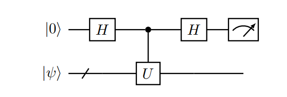
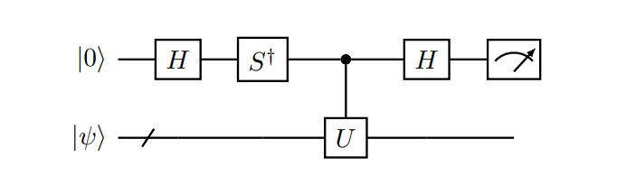
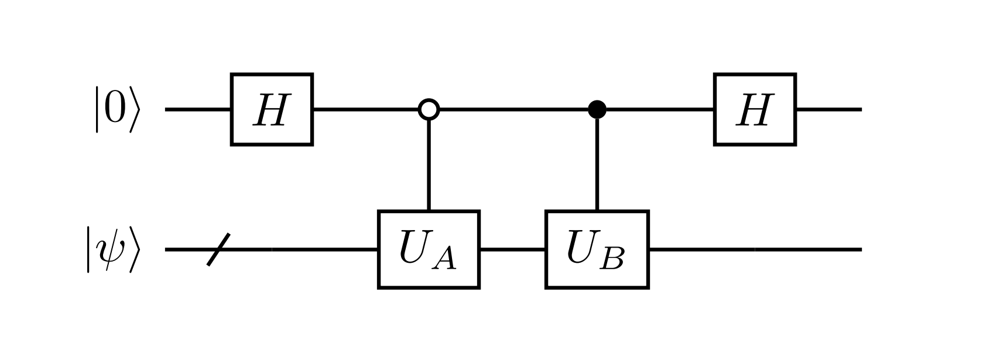

<h1> Quantum Scientific Computation </h1>

<h2> Content </h2>

- [Basic Quantum Algorithm](#basic-quantum-algorithms)

    - [Phase Kickback](#phase-kickback)

    - [Grover's Algorithm](#grovers-algorithm)

    - [Hadamard Test](#hadamard-test)

    - [Quantum Fourier Transform](#quantum-fourier-transform)

    - [Quantum Phase Estimation](#quantum-phase-estimation)

    - [Trotter Based Hamiltonian Simulation](#trotter-based-hamiltonian-simulation)

- [Matrix Computation over Quantum Computer](#matrix-computation-over-quantum-computer)

    - [Block Encoding](#block-encoding)

    - [Matrix Functions of Hermitian matrices](#matrix-functions-of-hermitian-matrices)

    - [Quantum Singular Value Transformation](#quantum-singular-value-transformation)

------------------------------------------------------------------------------

**NOTE:** More quantum algorithms can be found at [Zoo of quantum algorithms](https://quantumalgorithmzoo.org).

# Basic quantum algorithms

Some of them may be counterintuitive and sometimes it looks like we are trying to find applications of a particular quantum phenomena (formula).

## phase kickback

Let $f: \{0, 1\}^n \rightarrow \{0, 1\}$ be a boolean function, which can be queried via the following unitary

$$ U_f |x\rangle = (-1)^{f(x)} |x\rangle, $$

i.e., the value of $f(x)$ is returned as a phase factor. 

One of the quantum circuit to implement phase kickback is to use oracle as follows with an extra uncomputation ancilla qubit:

$$ U_f |x, y\rangle = |x, y \oplus f(x) \rangle, \quad x, y\in \{0, 1\}. $$

The concrete circuit depends on the function $f(x)$. Denote $\vert -\rangle = \frac{1}{\sqrt{2}}(\vert 0\rangle - \vert 1\rangle$, then we have 

$$ U_f |x\rangle |-\rangle = \cdots = (-1)^{f(x)}|x\rangle |-\rangle, $$

ignore the ancilla qubit $\vert -\rangle$ we have the phase kickback unitary $U_f$.

**Remark.** Combine phase kickback with Hadamard gates we could get the Deutsch's algorithm designed for the judgement of balanced boolean functions.

-----------------------------------------------------------------------

## Grover's algorithm 

**Problem setting (Unstructured search)**: Given a boolean function $f:\{0, 1\}^n \rightarrow \{0, 1\}$, there exists a unique marked state $x_0$ such that $f(x_0)=1$ and we would like to find $x_0$.

**Main idea**: Use an oracle to implement a phase kick, which turn out to be a reflection for some particular states, then combine two reflection to form a rotation. With the rotation operator to move the initial state to desired $\vert x_0\rangle$. 

The origin of quadratic speed up comes from the fact that classical probabilistic algorithms work with probability density, quantum algorithms work with wavefunction amplitudes, of which the square gives the probability density.

- **Step 1: Oracle and phase kickback**:

Given oracle 

$$ U_f |x, y\rangle = |x, y \oplus f(x)\rangle, \quad x\in \{0, 1\}^n, y \in \{0, 1\}. $$

Let $\vert y\rangle=\vert -\rangle$, we have phase kickback with an ancilla qubit:

$$ U_f |x, -\rangle = \cdots = (-1)^{f(x)} |x, -\rangle. $$

- **Step 2: initial state preparation**:

$$ |\psi_0\rangle = H^{\otimes n} |0^n\rangle = \frac{1}{N} \sum_{x\in[N]} |x\rangle, \quad N=2^n. $$

Our target is to rotate this state to close $\vert x_0\rangle$.

- **Step 3: rotation operator**:

Apply oracle $U_f$ to initial state we have 

$$ U_f |\psi_0\rangle = U_f (\alpha |x_0\rangle + \beta |\psi_0^{\bot}\rangle) = -\alpha |x_0\rangle + \beta |\psi_0^{\bot}\rangle. $$

Thus $U_f$ are actually the reflection operator 

$$ R_{x_0}=I - 2|x_0\rangle\langle x_0|. $$ 

In the same way one have reflection with $\psi_0$, 

$$ R_{\psi_0} = -(I-2|\psi_0\rangle\langle\psi_0|)=H^{\otimes n}(2|0\rangle\langle 0| - I) H^{\otimes n}. $$

Thus we have Grover rotation operator $G=R_{\psi_0}R_{x_0}$ such that

$$ G^k |\psi_0\rangle = \sin(\frac{2k+1}{2}\theta)|x_0\rangle + \cos(\frac{2k+1}{2} \theta) |\psi_0^{\bot}\rangle, $$

where we define $\vert \psi_0\rangle = -\sin(\theta/2)\vert x_0\rangle + \cos(\theta/2)\vert \psi_0^\bot\rangle$.

Finally, for $\sin((2k+1)\theta/2) \approx 1$ we need $k\approx \frac{\pi}{2\theta} - \frac{1}{2} \approx \frac{\sqrt{N}\pi}{4}$.

**Remark**: 

Grover's algorithm is not restricted to the problem of unstructured search. One immediate application is **amplitude amplification**, i.e., for

$$ |\psi_0\rangle = \sqrt{p_0}|\psi_{\text{good}}\rangle + \sqrt{1-p_0} |\psi_{\text{bad}}\rangle $$

we can amplify the amplitude of $\vert \psi_{\text{good}}\rangle$ to improve the success probability.

-------------------------------------------------------------------------------------

## Hadamard Test

Hadamard test is a useful tool for computing the expectation value of a unitary operator $U$ (in general not Hermitian) with respect to a state $\psi$, i.e., $\langle \psi \vert  U \vert  \psi \rangle$.

The real part and imaginary part of the expectation value need to be measured separately.

From the Hadamard test for real part expectation value, we have

$$ |0\rangle |\psi\rangle \xrightarrow{H \otimes I} ~\xrightarrow{c-U} ~ \xrightarrow{H \otimes I} \frac{1}{2} |0\rangle(I+U)|\psi\rangle + \frac{1}{2}|1\rangle(I-U) |\psi\rangle. $$

The probability of measuring the qubit 0 to be state $\vert 0\rangle$ is 

$$ p(0) = \frac{1}{2} (1 + \text{Re} \langle \psi |U|\psi\rangle). $$

Circuit model of Haramard test for $\text{Re} \langle \psi \vert U\vert \psi\rangle$:

Circuit model of Haramard test for $\text{Im} \langle \psi \vert U\vert \psi\rangle$:

----------------------------------------------------------------------------------

## Quantum Fourier transform

**Definition**:

For any $j$ in the computational basis, the (discrete) forward Fourier transform is defined as:

$$ U_{\text{FT}} |j\rangle = \frac{1}{N} \sum_{k\in [N]} \mathrm{e}^{\mathrm{i}2\pi\frac{kj}{N}} |k\rangle. $$

The (discrete) inverse Fourier transform is 

$$ U_{\text{FT}}^{\dagger} |j\rangle = \frac{1}{N} \sum_{k\in [N]} \mathrm{e}^{-\mathrm{i}2\pi\frac{kj}{N}} |k\rangle. $$

The circuit implementation of QFT relies on the following formula:

$$ U_{\text{FT}} |j_{n-1}\cdots j_0 \rangle = \frac{1}{2^n} \left(|0\rangle + \mathrm{e}^{\mathrm{i}2\pi(.j_0)} |1\rangle \right) \otimes \left(|0\rangle + \mathrm{e}^{\mathrm{i}2\pi(.j_1j_0)} |1\rangle \right) \otimes \cdots \otimes \left(|0\rangle + \mathrm{e}^{\mathrm{i}2\pi(.j_{n-1}\cdots j_0)} |1\rangle \right) $$

where we use the $n$-bit fixed point representation, i.e., for $a = \frac{k}{2^n} \in [0, 1)$ with integer $k$,

$$ a =\frac{k}{2^n} =\sum_{i\in[n]} k_i 2^{-n} =: (0.k_{n-1}\cdots k_0)$$

-----------------------------------------------------------------------------------

## Quantum phase estimation

### Problem: 

Let $U$ be a unitary, and $\vert \psi\rangle$ is an eigenvector, i.e., 

$$ U|\psi\rangle = \mathrm{e}^{\mathrm{i}2\pi \varphi |\psi\rangle}, \quad \varphi \in [0, 1), $$

the goal is to find $\varphi$ up to certain precision.

### Algorithm:

Suppose $\varphi = \frac{k}{2^d}$ for some $k\in [2^d]$, $d$ is the number of ancilla qubits, then we can use a pair of QFT and the power of $U$ to extract number $k$ by measuring ancilla qubits.

$$
\begin{align*}
    |0^{d}\rangle |\psi_{0}\rangle \xrightarrow{U_{\mathrm{FT}} \otimes I} 
    & \frac{1}{\sqrt{2^{d}}} \sum_{j \in [2^{d}]} |j\rangle |\psi_{0}\rangle \\
    \xrightarrow{\mathcal{U}} & \frac{1}{\sqrt{2^{d}}} \sum_{j \in [2^{d}]} |j\rangle U^{j} |\psi_{0}\rangle = \frac{1}{\sqrt{2^{d}}} \sum_{j \in [2^{d}]} |j\rangle \mathrm{e}^{\mathrm{i} 2 \pi \varphi j} |\psi_{0}\rangle \\
    & = \frac{1}{\sqrt{2^{d}}} \sum_{j \in [2^{d}]} |j\rangle \mathrm{e}^{\mathrm{i} 2 \pi \frac{kj}{2^d}} |\psi_{0}\rangle = (U_{\mathrm{FT}} \otimes I) |k\rangle |\psi_0\rangle \\
    \xrightarrow{U_{\mathrm{FT}} \otimes I} & |k\rangle |\psi_{0}\rangle
\end{align*}
$$

where $\mathcal{U}=\sum_{j\in[2^d]} \vert j\rangle \langle j\vert \otimes U^j $. $\vert \psi_0\rangle$ is the eigenvector corresponding to $\varphi$, which can be obtained in advanced or just used for immediate step during theoretic analysis.

Useful form:

Given a Hermitian matrix $A$ with eigenpair $A v = \lambda v$ satisfying $0 < \lambda < 1$ with an exact $d$-bit representation and $\|v\|=1$, then we have unitary operator $U_\text{QPE}= \mathrm{e}^{\mathrm{i}2\pi A}$ such that

$$ U_{\text{QPE}} |0^d\rangle |v\rangle = |\lambda\rangle |v\rangle, $$

where $\vert \lambda\rangle$ is the $d$-bit representation of $\lambda$.

### Application: HHL algorithm for linear systems

**Step 1: Convert $Ax=b$ into quantum linear system problem (QLSP)**

We assume $b\in \mathbb{C}^N$ is a normalized vector and $\vert b\rangle=U_b \vert 0^n\rangle$.

Note that $ \vert 1\rangle\langle 0\vert  =\begin{bmatrix} 0 & 0 \\ 1 & 0 \end{bmatrix} $, if $A$ is not Hermitian, we can enlarge the system to get a Hermitian matrix (dilation method), i.e.,

$$ \widetilde{A}=\begin{bmatrix} 0 & A^{\dagger} \\ A & 0 \end{bmatrix} = |1\rangle \langle0| \otimes A + |0\rangle \langle1| \otimes A^{\dagger}, $$

and solve $\widetilde{A}\vert 0, x\rangle=\vert 1, b\rangle$.

The QLSP is to find a quantum state $\vert \widetilde{x}\rangle$ so that

$$ \| |\widetilde{x}\rangle - |x\rangle \| \leq \epsilon, \quad |x\rangle = \frac{A^{-1}b}{\|A^{-1} b\|}. $$

**Step 2: Solve QLSP with eigendecomposition of Hermitian matrix $A$**

Suppose $A$ has the eigendecomposition $A\vert v_j\rangle=\lambda_i \vert v_j\rangle$. Then $\vert b\rangle = \sum_j \beta_j \vert v_j\rangle$, the unnormalized solution satisfies 

$$ A^{-1}|b\rangle = \sum_{j} \frac{\beta_j}{\lambda_j} |v_j\rangle $$

**Step 3: Use quantum circuit to express solution of QLSP**

Assume $0 < \lambda_0 \leq \lambda_1 \leq \cdots \leq \lambda_{N_1} < 1 $ and all eigenvalues have an exact $d$-bit representation.

Consider unitary matrix $U =\mathrm{e}^{\mathrm{i}2\pi A}$ and quantum phase estimation,

$$ U_{QPE} |0^d\rangle |b\rangle = \sum_j \beta_j |\lambda_j\rangle |v_j\rangle. $$

With controlled rotation unitary

$$ U_{CR} |0\rangle|\lambda_j \rangle = \left(\sqrt{1-\frac{C^2}{\widetilde{\lambda}_j^2}} |0\rangle + \frac{C}{\widetilde{\lambda}_j} \right) |\lambda_j\rangle, $$

where each $\widetilde{\lambda}_j$ approximates $\lambda_j$, $C>0$ is a constant decided by user being a lower bound to $\lambda_0$ such that $0 < C/\lambda_j < 1$ for all j.

Then we have 

$$ U_{HHL} |0\rangle|b\rangle = \sum_j \left(\sqrt{1-\frac{C^2}{\widetilde{\lambda}_j^2}} |0\rangle + \frac{C}{\widetilde{\lambda}_j} \right) \beta_j |\lambda_j\rangle. $$

Hence if the measurement of signal qubit is 1, we obtain

$$ \widetilde{x}=\sum_j \frac{C\beta_j}{\widetilde{\lambda}_j} |v_j\rangle, $$

which is stored as a normalized vector 

$$\frac{\widetilde{x}}{\|\widetilde{x}\|} \approx |x\rangle.$$

To retrieve the norm of the solution, we compute the success probability of measuring signal qubit

$$ p(1) = \left\|\sum_j \frac{C\beta_j}{\widetilde{\lambda}_j} |v_j\rangle \right\|^2 = \|\widetilde{x}\|^2 \approx C^2\|A^{-1}|b\rangle\| $$

**Step 0: complexity analysis**

The success probability $p(1)$ is determined by 

- the choice of the normalization constant $C$
- the norm of the true solution $\|x\|=\|A^{-1}\vert b\rangle\|$

For theoretical analysis, assume $C=\lambda_0$, if assume $\lambda_{N-1}=1$ further, one can connect with the condition number of matrix $A$, i.e.,

$$ \kappa := \|A\|\|A^{-1}\|=\frac{\lambda_{N-1}}{\lambda_0}=C^{-1}. $$

Futhermore, $\|A^{-1}\vert b\rangle\| \geq \frac{1}{\|A\|}\|\vert b\rangle\|=1$. Therefore $p(1)=\Omega(\kappa^{-2}).$

After connecting with the condition number, now we can perform the comparison with classical iterative linear system solvers and find applications that quantum computing can do better.

**Note: implementation of CR gate**

Given rotation angle in its $d$-bit fixed point representation, $\theta=.\theta_{d-1}\cdots\theta_{0}$, 

$$ U = \sum_{j\in[2^d]} \mathrm{exp}(-\mathrm{i}\pi(.j_{d-1}\cdots j_0)\sigma_y) \otimes |j\rangle\langle j|, \quad j/2^d = (.j_{d-1}\cdots j_0), $$

then

$$ U (|0\rangle |\theta\rangle) = \left(\cos(\pi\theta)|0\rangle + \sin(\pi\theta)|1\rangle \right) |\theta\rangle $$

However, to realize the desired controlled rotation for QLSP, one need to convert the coefficient into rotation angle, i.e., 

$$ \theta_j = \frac{1}{\pi} \arcsin(\frac{C}{\lambda_j}), $$

where $C > 0$ such that $0 < C/\lambda_j < 1$ is user-specific constant. The arcsin function can be implemented using classical arithmetics circuit. 

---------------------------------------------------------------------------------

## Trotter based Hamiltonian simulation

Problem: given an initial state $\vert \psi_0\rangle$ and a time-independent Hamiltonian $H$, evaluate the quantum state at time $t$ via

$$ |\psi(t)\rangle = \mathrm{e}^{-\mathrm{i}tH}|\psi_0\rangle. $$

Specifically, consider $H=H_1+H_2$, then one has Trotter splitting:

$$ \mathrm{e}^{-\mathrm{i}tH} = \lim_{n\rightarrow\infty} \left( \mathrm{e}^{-\mathrm{i}\frac{t}{n}H_1} \mathrm{e}^{-\mathrm{i}\frac{t}{n}H_2}\right)^n. $$

Let $\Delta t = t/n$, then we have first order Trotter method:

$$ \|\mathrm{e}^{-\mathrm{i}\Delta t H} - \mathrm{e}^{-\mathrm{i}\Delta t H_1} \mathrm{e}^{-\mathrm{i}\Delta t H_2} \| = O(\Delta t^2). $$

And further second order Trotter method

$$ \|\mathrm{e}^{-\mathrm{i}\Delta t H} - \mathrm{e}^{-\mathrm{i}\Delta t/2 H_2} \mathrm{e}^{-\mathrm{i}\Delta t H_1} \mathrm{e}^{-\mathrm{i}\Delta t/2 H_2} \| = O(\Delta t^3). $$

-----------------------------------------------------------------------------

# Matrix Computation over Quantum Computer

All the operations over quantum computer are unitary. Thus we have to encode the general matrix into unitary matrix and represent (approximate) their operations with unitary operations.

## Block Encoding

**Question:**

How to read-in and read-out the information of a matrix $A\in \mathbb{C}^{N \times N}$, which is generally not unitary in a quantum computer?

One possible method is via $\mathrm{e}^{\mathrm{i}t A}$ (if $A$ is not Hermitian, we can use the dilation method).

Some more general methods will be discussed below.

**Query model for matrix entries (read-out)**

Assume $A$ is an $n$-qubit, square matrix and $\vert A \vert_{\max}:=\max_{ij} \vert A_{ij}\vert < 1$. The desired query oracle takes the following general form:

$$ O_A |0\rangle |i\rangle |j\rangle = \left( A_{ij} |0\rangle + \sqrt{1-|A_{ij}|^2} |1\rangle\right) |i\rangle |j\rangle.$$

It is indeed a problem that how to implement this oracle. We will not get into the detail here.

**Heuristic Illustration:** 

Find a $(n+1)$-qubit unitary matrix $U\in \mathbb{C}^{2N\times 2N}$ such that 

$$ U_A = \begin{pmatrix} A & * \\ * & * \end{pmatrix}. $$

In order to obtain $A\vert b\rangle$, consider 

$$ |0, b\rangle = |0\rangle \otimes |b\rangle = \begin{pmatrix} 1 \\ 0 \end{pmatrix} \otimes b = \begin{pmatrix} b \\ 0 \end{pmatrix}, $$

and 

$$ U_A |0, b\rangle = \begin{pmatrix} Ab \\ * \end{pmatrix} = |0\rangle A|b\rangle + |1\rangle |\psi\rangle, $$

we only need to measure the qubit 0 and keep the state if it returns 0. The missing info of norm $\|A\vert b\rangle\|$ can be recovered via the success probability $p(0)$.

**Definition (Block encoding)**

Given an $n$-qubit matrix $A$, if we can find $\alpha, \epsilon\in\mathbb{R}_+$, and an $(m+n)$-qubit unitary matrix $U_A$ such that

$$ \|A - \alpha (\langle 0^m| \otimes I_n) U_A (|0^m\rangle \otimes I_n) \| \leq \epsilon, $$

then $U_A$ is called an $(\alpha, m, \epsilon)$-block-encoding of $A$, which consists the set denoted as $\text{BE}_{\alpha, m}(A, \epsilon)$.

Note: if 

$$ U_A = \begin{pmatrix} A & * & \cdots & * \\ \vdots & \vdots & \ddots & \vdots \\ * & * & * & * \end{pmatrix}, $$ 

then $A=(\langle 0^m\vert  \otimes I_n) U_A (\vert 0^m\rangle \otimes I_n)$ by some expansion of tensor products.

**Example**: 

For any $n$-qubit matrix $A$ with $\|A\|_2 \leq 1$, the SVD of $A$ is denoted as $A=W\Sigma V^{\dagger}$, then we may construct 

$$ 
\begin{align*}
U_A :=& \begin{pmatrix} W & 0 \\ 0 & I_n \end{pmatrix} 
\begin{pmatrix} \Sigma & \sqrt{I_n - \Sigma^2} \\ \sqrt{I_n - \Sigma^2} & -\Sigma \end{pmatrix} 
\begin{pmatrix} V^{\dagger} & 0 \\ 0 & I_n \end{pmatrix} \\
=& \begin{pmatrix} A & W\sqrt{I_n - \Sigma^2} \\ \sqrt{I_n - \Sigma^2}V^{\dagger} & -\Sigma \end{pmatrix} 
\end{align*}
$$

which is a $(1,1)$-block-encoding of $A$.

Note: Instead of first identifying $A$ and then finding its block encoding $U_A$, sometimes we reverse this though process: we first identifying unitary $U_A$ that is easy to implement on quantum computer, and then ask which matrix can be block encoded by $U_A$.

-------------------------------------------------------------------------------------
 

## Matrix Functions of Hermitian matrices

Many tasks in scientific computation can be expressed in terms of matrix functions.

- Hamiltonian simulation: $f(A)=e^{\mathrm{i}At}$.
- Gibbs state preparation: $f(A)=e^{-\beta A}$.
- Solving linear systems of equation: $f(A)=A^{-1}$.
- Eigenstate filtering: $f(A)=\mathbf{1}_{(-\infty, 0)} (A-\mu I)$.

Matrix function of Hermitian matrices is defined by the function of its eigenvalues, given function $f:\mathbb{R}\rightarrow \mathbb{C}$ and matrix $A=V\Lambda V^{\dagger}$, we define

$$ f(A) = Vf(\Lambda)V^{\dagger}, \quad f(\Lambda) = \text{diag}(f(\lambda_1), \cdots, f(\lambda_n)). $$

**Target: Compute any matrix function over quantum computer**

$$ \text{general function} \rightarrow \text{polynomial approximation} \rightarrow \text{qubitization} \rightarrow \text{quantum circuit} $$

--------------------------------------------------------------------------------

###  Linear combination of unitaries

Let $T=\sum_{i=0}^{K-1} \alpha_i U_i$ be the linear combination of $n$-by-$n$ unitary matrices $U_i$ (general matrix can be extended to a unitary matrices through block encoding). WLOG assume $K=2^a$, $\alpha_i > 0$.

Select oracle

$$ U := \sum_{i\in [K]} |i\rangle \langle i| \otimes U_i $$

Prepare oracle

$$ V |0^a\rangle = \frac{1}{\sqrt{\|\alpha\|_1}} \sum_{i\in[K]} \sqrt{\alpha_i} |i\rangle $$

**LCU Lemma:**

Define 

$$ W = (V^{\dagger} \otimes I_n ) U (V \otimes I_n). $$

Then for any $\vert \psi\rangle$, 

$$ W|0^a\rangle |\psi\rangle = \frac{1}{\|\alpha\|_1} |0^a\rangle T|\psi\rangle + |\widetilde{\bot}\rangle, $$

where $\vert \widetilde{\bot}\rangle$ is an un-normalized state satisfying $(\vert 0^a\rangle \langle 0^a\vert  \otimes I_n) \vert \widetilde{\bot}\rangle = 0.$

**Example: Linear combination of two matrices**

{:height="70%" width="70%"}

--------------------------------------------------------------------------------

### Qubitization of Hermitian matrices

Essential Fact: An arbitrarily unitary block encoding matrix $U_A$ can be partially block diagonalized into some subblocks of size $2\times 2$, with the transformed basis depending on the eigenvectors of $A$. 

This fact gives a method to design the circuit for the Chebyshev polynomials of matrix $A$ since for rotation matrix $O$,

$$ O(\lambda)=\begin{pmatrix}\lambda & -\sqrt{1-\lambda^{2}} \\ \sqrt{1-\lambda^{2}} & \lambda\end{pmatrix} = \begin{pmatrix} \cos \theta & -\sin \theta \\ \sin \theta & \cos \theta\end{pmatrix}, $$

one has

$$ O^{k}(\lambda) = \begin{pmatrix} \cos k\theta & -\sin k\theta \\ \sin k\theta & \cos k\theta\end{pmatrix} = \begin{pmatrix} T_{k}(\lambda) & -\sqrt{1-\lambda^{2}} U_{k-1}(\lambda) \\ \sqrt{1-\lambda^{2}} U_{k-1}(\lambda) & T_{k}(\lambda)\end{pmatrix}, $$

where 

$$ T_{k}(\lambda)=\cos (k \theta)=\cos (k \arccos \lambda), \quad U_{k-1}(\lambda)=\frac{\sin (k \theta)}{\sin \theta}=\frac{\sin (k \arccos \lambda)}{\sqrt{1-\lambda^{2}}} $$

are Chebyshev polynomials.

Similar, suppose $U_A$ is Hermitian, denote the eigen decomposition of $A$ as 

$$ A = \sum_i \lambda_i |v_i\rangle\langle v_i|. $$

Define 

$$ U_A |0^m\rangle |v_i\rangle = \lambda_i |0^m\rangle |v_i\rangle + \sqrt{1-\lambda_i^2} |\bot_i\rangle, $$

then basis $\mathcal{B}_i = \{\vert 0^m\rangle\vert v_i\rangle, \vert \bot_i\rangle \}$ forms a invariant subspace of $U_A$.

$$ \left[U_{A}\right]_{\mathcal{B}_{i}}=\begin{pmatrix} \lambda_{i} & \sqrt{1-\lambda_{i}^{2}} \\ \sqrt{1-\lambda_{i}^{2}} & -\lambda_{i}\end{pmatrix}  $$

In order to turn $U_A$ as a rotation, introduce

$$ \Pi = |0^m\rangle \langle 0^m| \otimes I_n  = \begin{pmatrix} I_n & 0 \\ 0 & 0 \end{pmatrix}, \quad Z_{\Pi} = 2\Pi  - I  = \begin{pmatrix} I_n &  \\  & -I \end{pmatrix},$$

hence, 

$$ O = U_A Z_{\Pi} = \begin{pmatrix} A & * \\ * & * \end{pmatrix}, \quad [O]_{\mathcal{B}_{i}} = \begin{pmatrix} \lambda_{i} & -\sqrt{1-\lambda_{i}^{2}} \\ \sqrt{1-\lambda_{i}^{2}} & \lambda_{i}\end{pmatrix}. $$

Thus, 

$$ \left[O^{k}\right]_{\mathcal{B}_{i}}=\left[\left(U_{A} Z_{\Pi}\right)^{k}\right]_{\mathcal{B}_{i}}= \begin{pmatrix} T_{k}\left(\lambda_{i}\right) & -\sqrt{1-\lambda_{i}^{2}} U_{k-1}\left(\lambda_{i}\right) \\ \sqrt{1-\lambda_{i}^{2}} U_{k-1}\left(\lambda_{i}\right) & T_{k}\left(\lambda_{i}\right)\end{pmatrix} $$

Note that $T_k(A)= \sum_i T_k(\lambda_i) \vert v_i\rangle \langle v_i\vert $, we then have 

$$ O^k = \begin{pmatrix} T_k(A) & * \\ * & * \end{pmatrix}, $$

which gives the block encoding of the Chebyshev polynomial of matrix $A$.

If $U_A$ is not Hermitian, we have

$$ U_{A}\left|0^{m}\right\rangle\left|v_{i}\right\rangle=\lambda_{i}\left|0^{m}\right\rangle\left|v_{i}\right\rangle+\sqrt{1-\lambda_{i}^{2}}\left|\perp_{i}^{\prime}\right\rangle, $$

$$ U_{A}^{\dagger}\left|0^{m}\right\rangle\left|v_{i}\right\rangle=\lambda_{i}\left|0^{m}\right\rangle\left|v_{i}\right\rangle+\sqrt{1-\lambda_{i}^{2}}\left|\perp_{i}\right\rangle. $$

Define 

$$ \mathcal{B}_{i}=\left\{\left|0^{m}\right\rangle\left|v_{i}\right\rangle,\left|\perp_{i}\right\rangle\right\}, \quad \mathcal{B}_{i}^{\prime}=\left\{\left|0^{m}\right\rangle\left|v_{i}\right\rangle,\left|\perp_{i}^{\prime}\right\rangle\right\}, $$

then we have 

$$ \left[U_{A}\right]_{\mathcal{B}_{i}}^{\mathcal{B}_{i}^{\prime}}=\begin{pmatrix} \lambda_{i} & \sqrt{1-\lambda_{i}^{2}} \\ \sqrt{1-\lambda_{i}^{2}} & -\lambda_{i}\end{pmatrix}, \quad 
\left[U_{A}^{\dagger}\right]_{\mathcal{B}_{i}^{\prime}}^{\mathcal{B}_{i}}=\begin{pmatrix} \lambda_{i} & \sqrt{1-\lambda_{i}^{2}} \\ \sqrt{1-\lambda_{i}^{2}} & -\lambda_{i}\end{pmatrix}. $$

Let $\widetilde{O}=U_A^{\dagger} Z_{\Pi}U_A Z_{\Pi}$, then 

$$ [\widetilde{O}]_{\mathcal{B}_{i}}=\begin{pmatrix} \lambda_{i} & -\sqrt{1-\lambda_{i}^{2}} \\ \sqrt{1-\lambda_{i}^{2}} & \lambda_{i}\end{pmatrix}^{2}. $$

Therefore, 

$$ (U_A^{\dagger} Z_{\Pi}U_A Z_{\Pi})^k = \begin{pmatrix} T_{2k}(A) & * \\ * & * \end{pmatrix}. $$

Note that $U_A$ and $U_A Z_{\Pi} (U_A^{\dagger} Z_{\Pi}U_A Z_{\Pi})^k $ shares the same invariant subspaces, we know that

$$ U_A Z_{\Pi} (U_A^{\dagger} Z_{\Pi}U_A Z_{\Pi})^k = \begin{pmatrix} T_{2k+1}(A) & * \\ * & * \end{pmatrix}. $$

-----------------------------------------------------------------------------------

### Quantum eigenvalue transformation

The construction of matrix function over quantum computer above is not practical due to the difficulty of oracle and complexity. 

Below we generalize the block encoding for Chebyshev polynomial and find methods to make it more practical.

The block encoding of Chebyshev polynomial can be written as 

$$ O^{d}=(-\mathrm{i})^{d} \prod_{j=1}^{d}\left(U_{A} e^{\mathrm{i} \frac{\pi}{2} Z_{\Pi}}\right). $$

Further, consider 

$$ U_{A}=\begin{pmatrix} x & \sqrt{1-x^{2}} \\ \sqrt{1-x^{2}} & -x\end{pmatrix}. $$ 

For any $\widetilde{\Phi} := (\widetilde{\phi}_0, \cdots, \widetilde{\phi}_d ) \in \mathbb{R}^{d+1}$,

$$ U_{\widetilde{\Phi}} := e^{\mathrm{i} \widetilde{\phi}_{0} Z} \prod_{j=1}^{d}\left(U_{A} e^{\mathrm{i} \widetilde{\phi}_{j} Z}\right) = \begin{pmatrix} P(x) & * \\ * & * \end{pmatrix},$$

where $P\in \mathbb{C}[x]$ satisfying certain conditions.

Conversely, we have the conclusion known as **quantum signal processing (QSP)**.

There exists a set of phase factors $\Phi:=(\phi_0, \cdots, \phi_d) \in \mathbb{R}^{d+1}$ such that 

$$ U_{\Phi}(x)=e^{\mathrm{i} \phi_{0} Z} \prod_{j=1}^{d}\left[O(x) e^{\mathrm{i} \phi_{j} Z}\right]=\begin{pmatrix} P(x) & -Q(x) \sqrt{1-x^{2}} \\ Q^{*}(x) \sqrt{1-x^{2}} & P^{*}(x) \end{pmatrix} $$

if and only if $P, Q\in\mathbb{C}[x]$ satisfy

- $\text{deg}(P) \leq d$, $\text{deg}(Q) \leq d - 1$,

- $P$ has parity $d \mod 2$ and $Q$ has parity $d-1 \mod 2$ and

- $\vert P(x)\vert ^2 + (1-x^2)\vert Q(x)\vert ^2 = 1$, $\forall x\in [-1, 1]$.

Note: if we are only interested in QSP for real polynomials $f(x)$, let $f(x)=\text{Re}(P(x))$, then the third condition above can be significantly relaxed.

**Optimization method for finding phase factors**

Given a target real polynomial $f(x)$ with degree $d$ and parity $d \mod 2$, $f(x)$ is entirely determined by its values on $\tilde{d}=\lceil\frac{d+1}{2} \rceil$ points $x_k$. The QSP problem can be equivalently solved via the following optimization problem:

$$ \Phi^{*}=\underset{\Phi \in[-\pi, \pi)^{d+1}}{\arg \min } F(\Phi), \quad F(\Phi):=\frac{1}{\tilde{d}} \sum_{k=1}^{\tilde{d}}\left|g\left(x_{k}, \Phi\right)-f\left(x_{k}\right)\right|^{2}, $$

where $g(x, \Phi):=\text{Re}(U(x, \Phi)).$

-----------------------------------------------------------------------------

## Quantum Singular Value Transformation

### Generalized matrix function

Given SVD of matrix $A\in\mathbb{C}^{N\times N}$ as $A=W\Sigma V^{\dagger}$ or equivalently

$$ A\left|v_{i}\right\rangle=\sigma_{i}\left|w_{i}\right\rangle, \quad A^{\dagger}\left|w_{i}\right\rangle=\sigma_{i}\left|v_{i}\right\rangle, \quad i \in[N]. $$

Let $f:\mathbb{R}\rightarrow \mathbb{C}$ be a scalar function, the generalized matrix function is defined as

$$ f^{\diamond}(A):=W f(\Sigma) V^{\dagger}, \quad f(\Sigma) = \text{diag}(f(\sigma_1), \cdots, f(\sigma_N)). $$

Besides,

$$ f^{\triangleleft}(A):=W f(\Sigma) W^{\dagger}, \quad f^{\triangleright}(A):=V f(\Sigma) V^{\dagger}. $$

-------------------------------------------------------------------------------------

### Qubitization of general matrices

$$ \mathcal{B}_{i}=\left\{\left|0^{m}\right\rangle\left|v_{i}\right\rangle,\left|\perp_{i}\right\rangle\right\}, \quad \mathcal{B}_{i}^{\prime}=\left\{\left|0^{m}\right\rangle\left|w_{i}\right\rangle,\left|\perp_{i}^{\prime}\right\rangle\right\}, $$

and $\widetilde{O}=U_A^{\dagger} Z_{\Pi}U_A Z_{\Pi}$, then 

$$ [\widetilde{O}]_{\mathcal{B}_{i}}=\begin{pmatrix} \sigma_{i} & -\sqrt{1-\sigma_{i}^{2}} \\ \sqrt{1-\sigma_{i}^{2}} & \sigma_{i}\end{pmatrix}^{2}. $$

Therefore, 

$$ (U_A^{\dagger} Z_{\Pi}U_A Z_{\Pi})^k = \begin{pmatrix} T^{\triangleright}_{2k}(A) & * \\ * & * \end{pmatrix}, \quad U_A Z_{\Pi} (U_A^{\dagger} Z_{\Pi}U_A Z_{\Pi})^k = \begin{pmatrix} T^{\diamond}_{2k+1}(A) & * \\ * & * \end{pmatrix}. $$

**Remark:** note that all singular values are non-negative, when performing the polynomial approximation, one can always extend the function $f$ to match the desired parity. For example,

$$ g(x)=\begin{cases} f(x), & x>0 \\ 0, & x=0 \\ -f(-x), & x<0\end{cases}, \qquad g(x)=\begin{cases} f(x), & x\geq 0 \\ -f(-x), & x<0\end{cases}. $$

----------------------------------------------------------------------------------

### QSVT with real polynomial

Under the same conditions as QET, we can find sequence of phase factors $\Phi\in\mathbb{R}^{d+1}$, so that for even $d$,

$$ U_{\Phi}=(-\mathrm{i})^{d} e^{\mathrm{i} \widetilde{\phi}_{0} Z_{\Pi}} \prod_{j=1}^{d / 2}\left[U_{A}^{\dagger} e^{\mathrm{i} \widetilde{\phi}_{2 j-1} Z_{\Pi}} U_{A} e^{\mathrm{i} \tilde{\phi}_{2 j} Z_{\Pi}}\right], $$

gives a $(1, m+1)$-block-encoding of $P^{\triangleright}(A)$ for some even polynomial $P\in\mathbb{R}[x]$; for add $d$,

$$ U_{\Phi}=(-\mathrm{i})^{d} e^{\mathrm{i} \widetilde{\phi}_{0} Z_{\Pi}}\left(U_{A} e^{\mathrm{i} \widetilde{\phi}_{1} Z_{\Pi}}\right) \prod_{j=1}^{(d-1) / 2}\left[U_{A}^{\dagger} e^{\mathrm{i} \widetilde{\phi}_{2 j} Z_{\Pi}} U_{A} e^{\mathrm{i} \widetilde{\phi}_{2 j+1} Z_{\Pi}}\right], $$

gives a $(1, m+1)$-block-encoding of $P^{\diamond}(A)$ for some odd polynomial $P\in \mathbb{R}[x]$.

In general, the QSVT circuit takes the form

$$ U_{\Phi}=\mathrm{CR}_{\tilde{\phi}_{0}} \cdots \mathrm{CR}_{\tilde{\phi}_{d-2}} U_{A}^{\dagger} \mathrm{CR}_{\tilde{\phi}_{d-1}} U_{A} \mathrm{CR}_{\tilde{\phi}_{d}}. $$

**Remark**:

This formulation gives the freedom to insert unitary matrices $P, Q$ and lead to the equivalent QSVT transformation

$$ U_{\Phi}=\cdots\left(Q U_{A} P^{\dagger}\right)^{\dagger}\left(Q \mathrm{CR}_{\widetilde{\phi}_{d-1}} Q^{\dagger}\right)\left(Q U_{A} P^{\dagger}\right)\left(P \mathrm{CR}_{\widetilde{\phi}_{d}} P^{\dagger}\right) P. $$

Assume $\widetilde{U}_A=QU_A P^{\dagger}$, then $U_A$ is the matrix representation of $\widetilde{U}_A$ with respect to the bases given by $P, Q$, respectively. This can be useful for certain application, e.g., fixed-point amplitude amplification.
